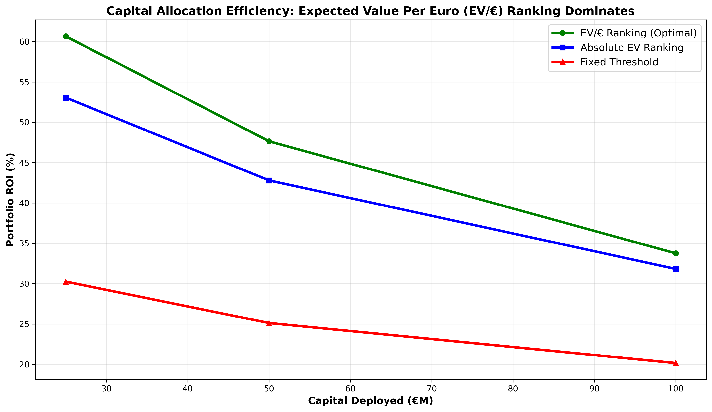
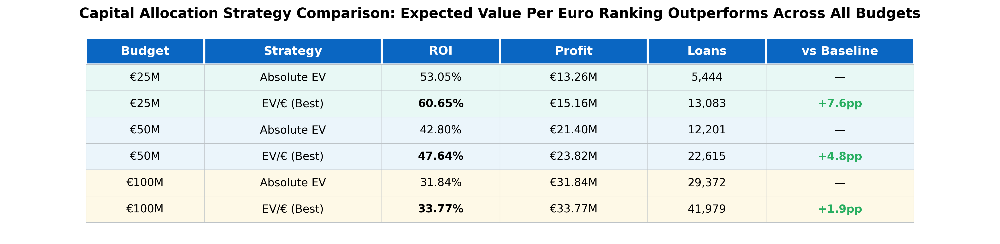
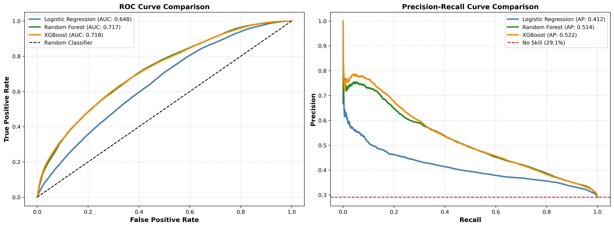
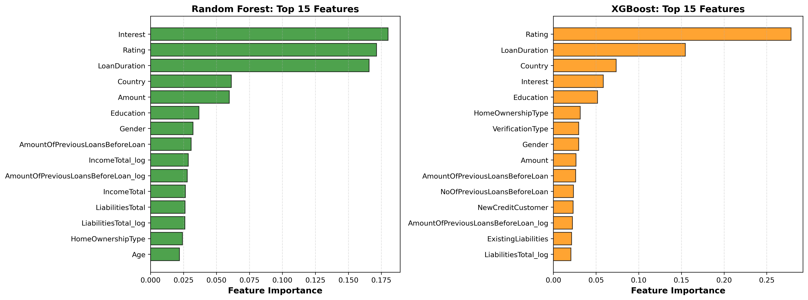
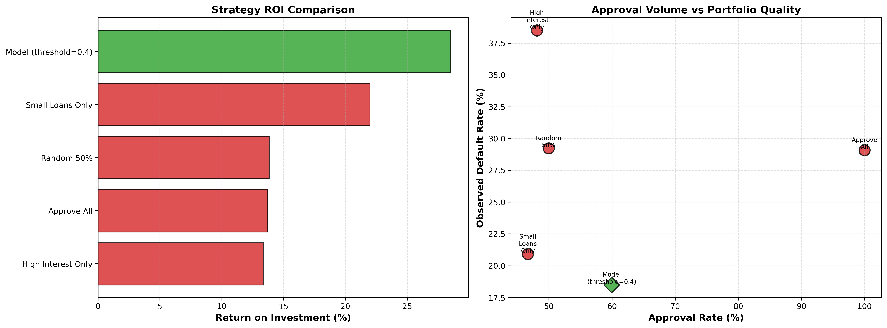

# Credit-Risk-Modeling-and-Capital-Allocation-in-P2P-Lending

## Table of Contents
- [Project Background](#project-background)
- [Objectives](#objectives)
- [Modeling Approach](#modeling-approach)
- [Training & Evaluation Design](#training--evaluation-design)
- [Executive Summary of Results](#executive-summary-of-results)
- [Key Analyses Included](#key-analyses-included)
- [Key Takeaways](#key-takeaways)
- [Limitations & Assumptions](#limitations--assumptions)
- [Future Work](#future-work)
- [Technologies Used](#technologies-used)
- [Why This Project Matters](#why-this-project-matters)

## Project Background

Peer-to-peer lending platforms deploy over $150 billion globally but struggle with a fundamental trade-off: expanding loan origination while controlling credit risk. Unlike traditional banks, P2P platforms operate under explicit capital constraints, making efficient capital deployment as critical as accurate default prediction.

This project analyzes ~410,000 historical consumer loans (2009–2024) to develop a machine-learning–driven credit risk framework that goes beyond classification accuracy and directly optimizes portfolio-level financial outcomes. The analysis demonstrates how predictive models can be translated into expected returns, capital allocation decisions, and realized profitability under realistic business constraints.

The project is designed to mirror how credit models are evaluated and deployed in professional lending environments: beginning with interpretable baselines, progressing to advanced ensemble models, and ultimately embedding predictions into decision strategies that maximize return on capital.

All code, data processing steps, and detailed methodology can be found here:
[GitHub Repository: Bondora Credit Risk Analysis](https://github.com/your-username/bondora-credit-risk-analysis)

## Objectives

The analysis addresses three core business questions:

1. **Prediction:** Can machine learning models meaningfully improve default prediction over interpretable baselines?

2. **Decision-making:** How should predicted default probabilities be translated into loan approval decisions?

3. **Capital allocation:** Given limited capital, which deployment strategies maximize portfolio-level returns?

## Modeling Approach

Three supervised learning approaches were evaluated:
+ **Logistic Regression** — interpretable baseline aligned with regulatory and explainability requirements

+ **Random Forest** — nonlinear ensemble capturing interactions and categorical effects

+ **XGBoost** — gradient-boosted trees optimized for predictive performance

## Training & Evaluation Design

+ **Time-based split:**

  + Training: 2012–2021 originations

  + Test: 2022–2024 originations

  + Prevents temporal leakage common in credit modeling

+ **Class imbalance handling:** balanced class weights (training default rate ≈ 55%)

+ **Evaluation metrics:** ROC-AUC, Average Precision, calibration diagnostics, and threshold sensitivity

## Executive Summary of Results

### Business Impact

Model outputs were converted into **expected return, expected loss, and net expected value per loan**, enabling evaluation of real lending strategies:

+ Threshold-based approval rules achieve up to **28.52% ROI**, more than doubling indiscriminate lending (13.71%)

+ Capital-constrained optimization delivers the strongest results:

  + 60.65% ROI on €25M

  + 47.64% ROI on €50M

+ Ranking loans by expected value per euro invested consistently outperforms:

  + Fixed probability thresholds

  + Absolute expected value ranking

  + Naïve heuristics (e.g., high interest only, small loans only)

**Key Insight:** Modest improvements in model discrimination translate into **15–45 percentage point gains in ROI** when deployed correctly.

_**Figure 1:** Under binding capital constraints, ranking loans by expected value per euro invested consistently dominates both fixed probability thresholds and absolute expected value selection across all tested budget levels (€25M–€100M)._

---

_**Table 1:** Capital allocation strategy performance across budget levels. Expected value per euro ranking consistently outperforms absolute EV ranking, achieving both higher ROI and greater loan diversification._

### Model Performance & Validation

Achieving superior portfolio returns requires models that can reliably discriminate between good and bad loans. Three supervised learning approaches were evaluated with ensemble models demonstrating clear superiority:

+ **Random Forest:** 0.72 ROC-AUC, 0.52 Average Precision
+ **XGBoost:** 0.71 ROC-AUC, 0.51 Average Precision  
+ **Logistic Regression:** 0.65 ROC-AUC, 0.41 Average Precision

_**Figure 2:** Model discrimination under class imbalance. Ensemble models significantly outperform logistic regression in both ROC-AUC and Average Precision. Precision–Recall curves confirm that gains persist in the minority default class, validating the use of ensemble probability estimates for downstream economic optimization._

+ Predictive power is driven primarily by:

  + Interest rate (pricing signal)

  + Credit grade

  + Loan duration

  + Country-level risk differences

_**Figure 3:** Feature importance across ensemble models. Interest rate dominates both Random Forest and XGBoost predictions, confirming that loan pricing effectively captures underlying credit risk. The convergence on key features (Interest, LoanDuration, ExistingLiabilities) validates model reliability._

## Key Analyses Included

+ Feature importance & model interpretability

+ Threshold sensitivity analysis (precision–recall trade-offs)

+ Comparison against naïve lending baselines

+ Expected value–based portfolio construction

+ Capital-constrained optimization under multiple budget levels

+ Observed default behavior vs. predicted risk

The analysis demonstrates clear value creation through systematic selection:

_**Figure 4:** Model-driven selection (28.52% ROI) substantially outperforms all naive strategies. High-interest-only screening suffers from adverse selection (38.5% default rate), while random selection provides minimal benefit over accepting all applications._

## Key Takeaways

+ AUC alone is insufficient — value is created at deployment

+ Expected value per euro ranking strictly dominates fixed thresholds under capital constraints

+ Smaller, high-efficiency loans materially improve portfolio diversification and ROI

+ Ensemble models create the most value at the portfolio level, while logistic regression remains suitable for individual decision explainability

## Limitations & Assumptions

+ **Maturity bias:** Test loans (2022–2024) have only 0–3 years of seasoning, reducing observed defaults (29% vs. 55% in training)

+ **Feature limitations:** No external credit bureau data (e.g., FICO, payment history)

+ **Zero recovery assumption:** Defaults assumed to have zero recovery (conservative)

+ **Geographic specificity:** Results reflect five European markets with highly heterogeneous default rates (22–91%)

## Future Work

+ Incorporate credit bureau and transaction-level data

+ Apply survival analysis for time-to-default modeling

+ Use SHAP values for instance-level explainability

+ Explore cost-sensitive learning during training

+ Conduct fairness and bias audits across demographic and regional segments

## Technologies Used

+ Python — data processing, modeling, evaluation

+ Scikit-learn — logistic regression, Random Forest

+ XGBoost — gradient-boosted trees

+ Pandas / NumPy — data manipulation

+ Matplotlib / Seaborn — visualization

+ Jupyter Notebook — end-to-end reproducible analysis

+ GitHub — version control and documentation

## Why This Project Matters

This project demonstrates how machine learning creates measurable economic value when models are evaluated and deployed through a business-first lens. Rather than optimizing predictive metrics in isolation, the analysis shows how credit risk models inform real capital allocation decisions — the difference between a model that looks good on paper and one that materially improves financial performance.

For P2P investors and lending platforms, the difference between systematic and naive lending strategies represents millions in potential profit. This analysis demonstrates how machine learning creates measurable economic value when models are deployed through a business-first lens — transforming credit risk from a compliance exercise into a competitive advantage.
